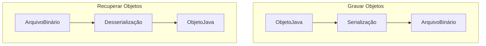

```mermaid

flowchart TB
    subgraph Gravar Objetos
    Gravar1["ObjetoJava"] -->
    Serialização -->
    Gravar["ArquivoBinário"]
    end

    subgraph Recuperar Objetos
    Recuperar1["ArquivoBinário"] -->
    Desserialização -->
    Recuperar["ObjetoJava"]
    end
```