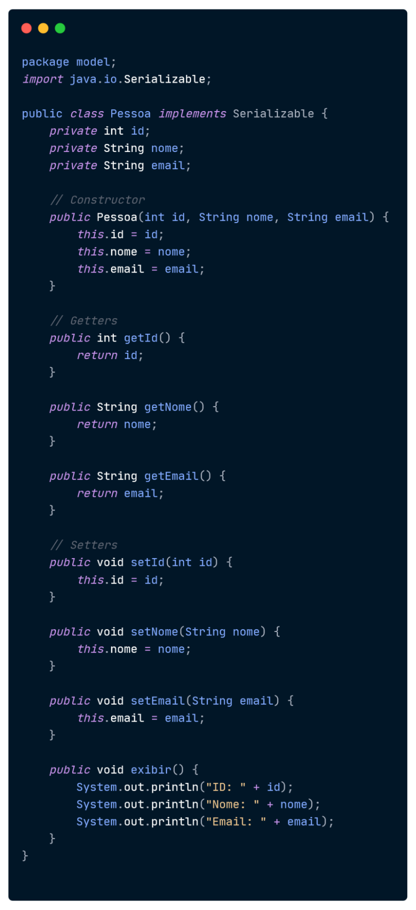
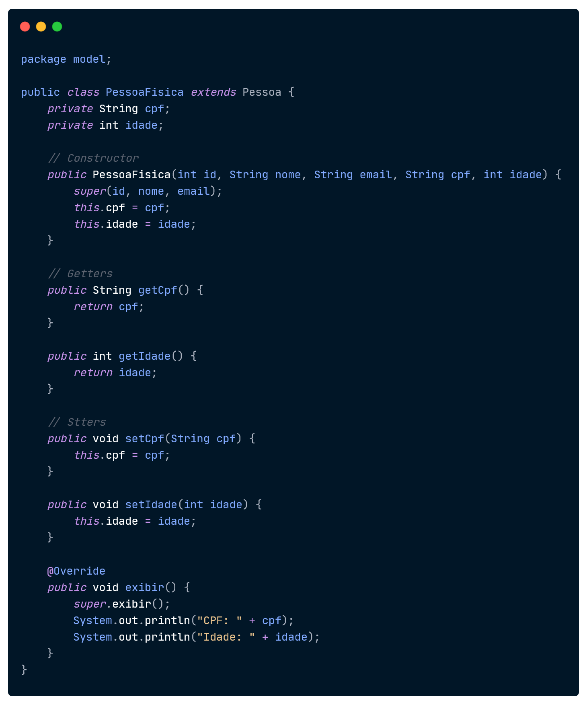
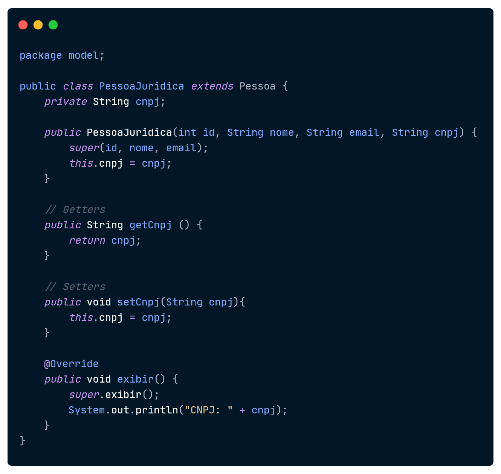
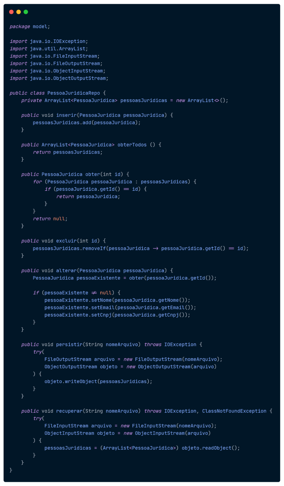
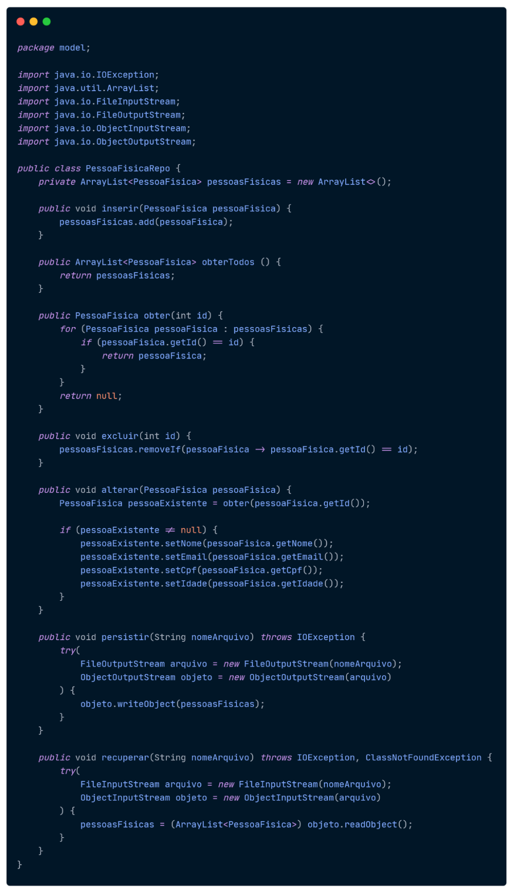
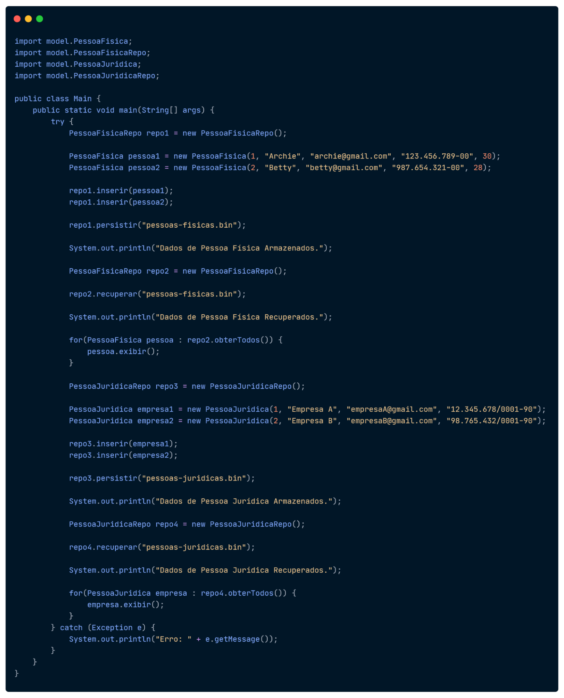
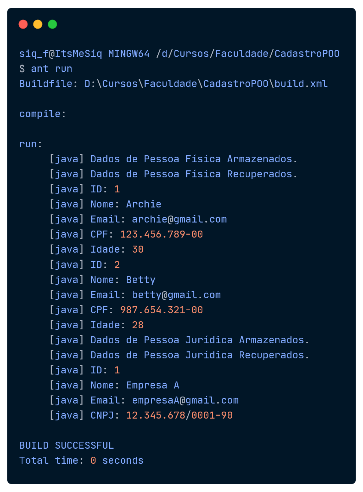
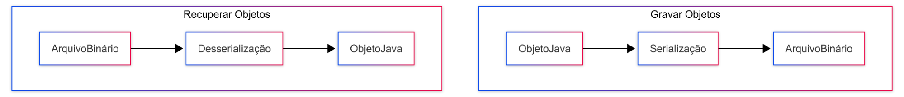

# Introdução

Este relatório apresenta o desenvolvimento do primeiro procedimento da prática de Programação Orientada a Objetos, voltado à implementação das Entidades e Sistemas de Persistência de um sistema de cadastro de pessoas.

Nesta etapa, foi desenvolvida as classes Pessoa, PessoaFisica, PessoaJurica e os repositórios PessoaFisicaRepo e PessoaJuridicaRepo.

O desenvolvimento do procedimento permitiu aplicar, de forma prática, conceitos de Programação Orientada a Objetos, como herança, encapsulamento, criação e utilização de objetos, além da separação das responsabilidades entre as entidades e os respectivos repositórios.

# Objetivos

## Objetivo Geral

Desenvolver uma aplicação Java orientada a objetos para cadastro de pessoas físicas e jurídicas, utilizando os conceitos de classes, herança, polimorfismo, encapsulamento e interfaces, além de implementar o armazenamento e a recuperação dos objetos em arquivos binários por meio de serialização e repositórios baseados em ArrayList para o gerenciamento das entidades. 

# Desenvolvimento

Inicialmente, foi criado o projeto CadastroPOO, utilizando Java e Apache Ant para compilação e execução da aplicação. As entidades foram organizadas no pacote model:

##  Classe Pessoa

A classe Pessoa foi utilizada como classe-base da aplicação, contendo os atributos:

- id
- nome
- email

Foram implementados construtor, getters, setters e o método exibir().

A classe também implementa a interface Serializable, permitindo que os objetos possam ser serializados e armazenados em arquivos binários. Como as demais classes criadas herdam de Pessoa, essa interface foi  implementada somente nessa classe. 

Visando reaproveitamento do código e evitando repetir trechos desnecessários.

### Classe PessoaFisica

Além dos atributos herdados de Pessoa, foram adicionados:

- cpf
- idade

A classe possui construtor, getters, setters e sobrescreve o método exibir(). Utilizando super.exibir() para reaproveitar o comportamento definido na classe Pessoa.

### Classe PessoaJuridica

Além dos atributos herdados de Pessoa, foi adicionado:

- cnpj
A classe possui construtor, getters, setters e sobrescreve o método exibir(). Utilizando super.exibir() para reaproveitar o comportamento definido na classe Pessoa.

### Repositório

Foram criados os repositórios: PessoaFisicaRepo e PessoaJuridicaRepo. Cada repositório mantém um ArrayList com suas respectivas entidades e implementa as seguintes operações:

- Inserir
- Obter Todos
- Obter
- Excluir
- Alterar
- Persistir
- Recuperar

## Main e Resultados da Execução 

## Análise e Conclusão 

### Quais as vantagens e desvantagens do uso de herança? 

A herança permite criar novas classes a partir de classes existentes, possibilitando o reaproveitamento de atributos e comportamentos. Além disso também existe a possibilidade de utilizar polimorfismo, permitindo que as classes derivadas forneçam diferentes implementações para o métodos existentes, utilizando o @Override.

Como desvantagem, o uso excessivo de herança pode aumentar o acoplamento entre as classes, fazendo com que alterações na classe-pai tenham impacto nas classes filhas. Por esse motivo, a herança deve ser utilizada quando existe uma relação adequada de especialização entre as classes.

### Por que a interface Serializable é necessária ao efetuar persistência em arquivos binários? 

A interface Serializable permite que os objetos sejam convertidos para uma representação que pode ser armazenada em arquivos binários, como arquivos com a extensão .bin. Dessa forma, os objetos presentes nos ArrayList puderam ser serializados e posteriormente reconstruídos durante a recuperação.

No projeto, Pessoa implementou Serializable e suas subclasses herdaram essa característica, permitindo a persistência das entidades.

### Como o paradigma funcional é utilizado pela API Stream no Java? 

A API Stream permite processar coleções utilizando operações funcionais, como filtragem, transformação e iteração, utilizando expressões lambda.

Por exemplo:

pessoas.stream()
       .filter(p -> p.getId() > 1)
       .forEach(p -> p.exibir());

Nesse exemplo, a coleção é transformada em um Stream, os elementos são filtrados por uma condição e, posteriormente, processados.
Embora a implementação principal desta prática tenha utilizado diretamente ArrayList, o conceito de Stream está relacionado à abordagem funcional utilizada pelo Java para processamento de coleções.

### Quando trabalhamos com Java, qual padrão de desenvolvimento é adotado na persistência de dados em arquivos? 

No desenvolvimento Java, o padrão mais utilizado para organizar e isolar a persistência de dados em arquivos é o DAO (Data Access Object), frequentemente complementado pelo padrão Repository.

O padrão DAO tem como principal objetivo centralizar todas as operações de acesso a dados (como criar, ler, atualizar e excluir), separando completamente essa responsabilidade da lógica de negócio da aplicação. Já o padrão Repository atua de forma semelhante, mas com uma visão mais voltada para o domínio da aplicação, tratando o conjunto de dados como uma coleção de objetos.

No contexto do projeto, os repositórios PessoaFisicaRepo e PessoaJuridicaRepo foram responsáveis por encapsular toda a lógica de persistência. Eles funcionaram como uma implementação prática desses padrões, pois concentraram as operações de manipulação dos dados e esconderam os detalhes de leitura e escrita em arquivos binários. A persistência foi realizada por meio de serialização de objetos com ObjectOutputStream e ObjectInputStream, mas essa implementação ficou totalmente encapsulada dentro dos repositórios, garantindo o desacoplamento entre a regra de negócio e a camada de persistência.

O fluxo de funcionamento pode ser representado da seguinte forma:

